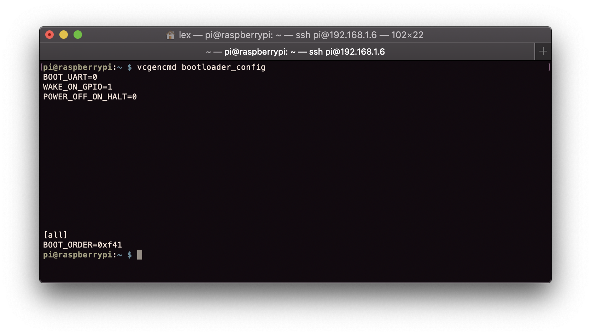

# Boot vanaf SSD


Tijd: 15 minuten


Sinds september 2020 is het officieel mogelijk om je Pi van een SSD op te starten in plaats van de microSD. Opstarten op deze manier geeft [betere performance](https://www.tomshardware.com/news/raspberry-pi-4-ssd-test,39811.html). Daarnaast omzeil je hiermee het gedoe van het mounten en tegen ieder stukje software zeggen dat die van de SSD gebruik moet maken. Aangezien we de SSD toch al hebben, waarom zouden we het dan niet doen?

Steek de microSD en netwerkkabel in de Pi waarna je de stroom aansluit. Na ongeveer een minuutje zal de Pi opgestart zijn en een IP-adres krijgen van je router. Log in op je router, want dit IP-adres heb je nodig. De meeste routers kun je in door naar 192.168.1.1 te gaan in je browser, maar hoe jouw netwerk is ingericht weet je zelf het best.

## SSH

[Secure Shell](https://nl.wikipedia.org/wiki/Secure_Shell) is een protocol om op een versleutelde manier in te loggen op een andere computer, en op afstand commando's op de andere computer uit te voeren via een terminal. Middels dit protocol is het mogelijk om vanaf onze computer de Pi aan te sturen.

Open een terminal en typ:

```bash
ssh pi@IP-ADRES VAN PI
```

Vervang in het commando "IP-ADRES VAN PI" met iets als 192.168.1.6. Zodra je op enter drukt zal je een vraag krijgen waar je YES/NO op kunt antwoorden. Typ "yes" en druk op enter. Je krijgt nu de vraag een wachtwoord in te voeren. Het standaard wachtwoord is **raspberry**.

Wat hebben we nu net gedaan? Je hebt met het commando aangegeven dat je van SSH gebruik wil maken. Vervolgens specificeer je een gebruikersnaam en een computer \(bereikbaar via een IP-adres\).

## Update

Voer de volgende commando's uit:

```bash
sudo apt update
```

```bash
sudo apt full-upgrade -y
```

```bash
sudo rpi-update
```

```bash
sudo reboot
```

Je Pi zal nu opnieuw opstarten waarna je opnieuw erin moet SSH'en.

## Boot configuratie

Voer de volgende commando's uit:

```bash
sudo rpi-eeprom-update -d -a
```


Als het goed is staat er dat de BOOTLOADER up-to-date is en zijn de waardes achter CURRENT en LATEST gelijk aan elkaar.

Het is tijd om de Pi te configureren.

```bash
sudo raspi-config
```

Er toont zich een scherm waardoor het lijkt alsof je in de jaren '80 beland bent. Kies "6 Advanced Options".


Kies "A7 Boot ROM Version".


Kies "E1 Latest".


Kies "No" en druk op"Ok".


Kies nog een keer voor "6 Advanced Options", maar ga dit maal voor "A6 Boot Order".


Kies "B1 USB Boot" en druk op "Ok".


Kies voor "Finish" om de instellingen af te ronden.


En tot slot "Yes" om opnieuw op te starten.


## Dubbelcheck

Om te controleren of alles goed is gegaan moet je weer de Pi in SSH'en. Voer het volgende uit.

```bash
vcgencmd bootloader_config
```

Op de onderste regel moet staan **BOOT\_ORDER=0xf41**. Als er **BOOT\_ORDER=0x0** staat, heb je iets fout gedaan.



Sluit je Pi af met:

```bash
sudo shutdown now
```

## Booten

Nu we de bootloader correct hebben ingesteld, kunnen we van de SSD booten. Haal de microSD uit de Pi en sluit de SSD aan. Zet de stroom erop et voilà!

